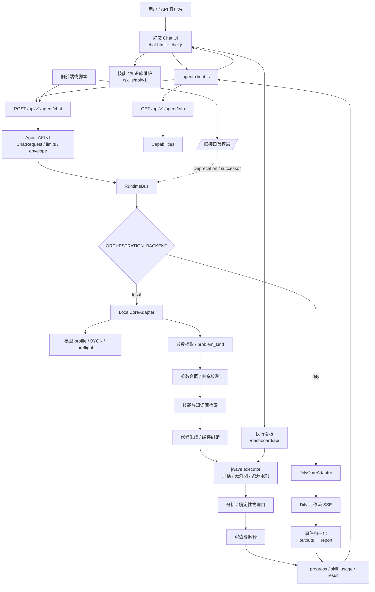

# AcouAgent 全工作流

> 机器可编辑源文件：[acouagent-workflow-flow.mmd](acouagent-workflow-flow.mmd)。GitHub、VS Code 和常见 Markdown 预览器可直接渲染下图。

```mermaid
flowchart TD
  U[用户 / API 客户端] --> FE[静态 Chat UI<br/>chat.html + chat.js]
  FE --> AC[agent-client.js]
  AC --> INFO[GET /api/v1/agent/info]
  AC --> CHAT[POST /api/v1/agent/chat]
  CHAT --> API[Agent API v1<br/>ChatRequest / limits / envelope]
  INFO --> CAP[Capabilities]
  API --> BUS[RuntimeBus]
  BUS --> SEL{ORCHESTRATION_BACKEND}
  SEL -->|local| LOCAL[LocalCoreAdapter]
  SEL -->|dify| DIFY[DifyCoreAdapter]
  LOCAL --> MODEL[模型 profile / BYOK / preflight]
  LOCAL --> EXTRACT[参数提取 / problem_kind]
  EXTRACT --> CONTRACT[参数合同 / 共享校验]
  CONTRACT --> SKILL[技能与知识库检索]
  SKILL --> GEN[代码生成 / 缓存纠错]
  GEN --> EXEC[jwave executor<br/>只读 / 无外网 / 资源限制]
  EXEC --> ANALYZE[分析 / 确定性物理门]
  ANALYZE --> REVIEW[审查与解释]
  REVIEW --> EVENTS[progress / skill_usage / result]
  DIFY --> DSTREAM[Dify 工作流 SSE]
  DSTREAM --> NORMALIZE[事件归一化<br/>outputs → report]
  NORMALIZE --> EVENTS
  EVENTS --> AC
  AC --> FE
  FE --> SIDE[技能 / 知识库维护<br/>/skills/api/v1]
  FE --> DASH[执行看板<br/>/dashboard/api]
  DASH --> EXEC
  LEGACY[/旧接口兼容层/] -. Deprecation / successor .-> BUS
  OLDCLIENT[旧前端或脚本] --> LEGACY
  OLDCLIENT --> CHAT
```
